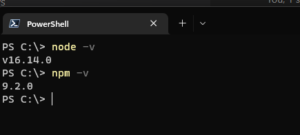

# MiniBlog

Projeto de um mini blog feito em react para aprendizado

## ferramentas utilizadas

* React

## Rodar o projeto

1- instale o Node em seu computador

* pelo site oficial, basta [clicar aqui](https://nodejs.org/en/)

2- Verifique se foi instalado corretamente o node e o npm

* abra o powershell e digite:
  
  ```shell
   node -v
   ```

* e depois:

  ```shell
    npm -v
  ```

se tiver resultados parecido a este com a versão dos dois está instalado corretamente.



3- Clone o repositório do projeto em alguma pasta no seu computador

```shell
git clone https://github.com/Evertonmag/MiniBlog.git
```

4- Entre na pasta do projeto

```shell
cd .\SecretWord\PrimeiroProjeto\secret_word\
```

5-Inicie o projeto pelo npm

```shell
npm start
```
